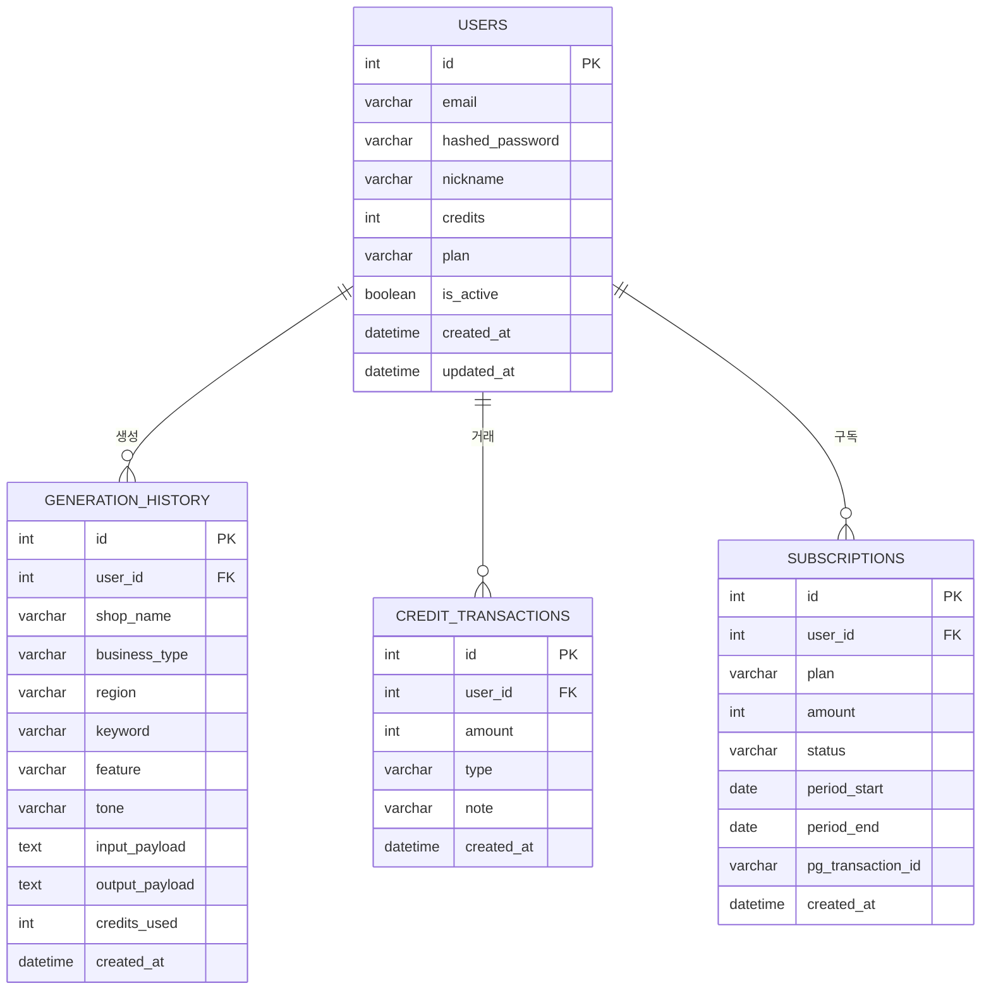

# OwnerBot — 개발과정 기록

> 작성: 유가영 + Claude AI (claude-sonnet-4-6)
> 시작일: 2026-04-06
> 최종 수정: 2026-04-06
> 목표: AI 콘텐츠 자동 생성 플랫폼 — 해커톤 발표 2026년 5월 14일

---

## 프로젝트 개요

| 항목 | 내용 |
|------|------|
| 프로젝트명 | OwnerBot (사장봇) |
| 슬로건 | "키워드 하나로 블로그·리뷰·쇼츠 대본까지 자동 생성" |
| 목표 | 소상공인이 키워드만 입력하면 네이버 상위노출 콘텐츠를 즉시 자동 생성해 주는 AI 마케팅 도구 |
| 타겟 | 동네 소상공인 — 피부관리, 음식점, 학원, 헤어샵, 네일샵 등 (직원 5인 이하) |
| 플랫폼 | 웹 서비스 (PC + 모바일 반응형) |
| 개발방식 | UI-first (mockup → ERD → FastAPI 백엔드 → Jinja2 HTML 프론트) |
| 해커톤 | 2026-04-06 ~ 2026-05-14 (약 6주) |

---

## 팀 구성

| 이름 | 반 | 역할 | 담당 |
|------|----|------|------|
| 유가영 | 창업반 | 팀장 / PM | 서비스 기획, IA, 와이어프레임, PRD |
| 이제민 | 취업반 | 팀원 | 백엔드 (FastAPI) |
| 박동제 | 취업반 | 팀원 | 프론트엔드 (PC 웹) |
| 김정원 | 취업반 | 팀원 | 프론트엔드 (PC 웹) |
| 유동주 | 1인개발 | 팀원 | mockup·ERD·개발과정.md·React 모바일 (EC2 단독) |

---

## 서비스 핵심 가치

### AS-IS (현재 문제)

| 문제 | 설명 |
|------|------|
| 온라인 홍보 시간 부족 | 블로그 글 1편 작성에 평균 1~2시간 소요 |
| SEO 구조 이해 부족 | 네이버 C-rank·다이아 로직을 몰라 노출 효과 저조 |
| 마케팅 대행 비용 부담 | 월 30~50만 원 이상 — 소규모 사업자에게 과중한 고정비 |
| 영상 콘텐츠 진입 장벽 | 쇼츠·릴스 대본 작성 자체가 어려워 포기 |

### TO-BE (개선 방향)

| 개선 | 설명 |
|------|------|
| 1분 만에 콘텐츠 완성 | 가게 정보 + 키워드 입력만으로 4종 콘텐츠 즉시 생성 |
| SEO 로직 자동 내재화 | 업종·지역·키워드를 조합한 최적화 프롬프트 |
| 저렴한 월 구독 모델 | 월 29,000원 무제한 — 대행사 대비 1/10 비용 |
| 쇼츠 대본 자동화 | 3컷 구조 대본을 AI가 자동 생성, 촬영만 하면 됨 |

---

## 비즈니스 모델

### 서비스 플로우

```
① 사용자 서비스 접속
        ↓
② 로그인 여부 확인
        ↓
    비로그인 → 1회 무료 체험 허용
        ↓
③ 입력 폼 작성 (가게명·업종·지역·키워드·특징·톤)
        ↓
④ 콘텐츠 생성 버튼 클릭
        ↓
⑤ OpenAI API 호출 → 스트리밍 출력
        ↓
⑥ 결과 확인 (블로그·리뷰·쇼츠·썸네일 탭)
        ↓
⑦ 복사 / 히스토리 저장
        ↓
⑧ 회원가입 유도 → 크레딧 충전 → 계속 사용
```

### 크레딧 구조

| 구분 | 내용 |
|------|------|
| 비로그인 무료 | 1회 체험 (세션 기반) |
| 가입 무료 | 3크레딧 자동 지급 |
| 건당 결제 | 5,000원 / 1회 |
| 월 구독 | 29,000원 / 무제한 |

---

## MVP 범위

### 포함 기능 (MVP)

- 콘텐츠 자동 생성 (블로그·리뷰·쇼츠 대본·썸네일 문구 4종)
- 입력 폼 — 가게명·업종·지역·키워드·특징·톤 선택 6개 필드
- 결과 탭 뷰 + 1-click 복사
- 회원가입 / 로그인 (이메일 + JWT)
- 히스토리 기능 — 목록 조회·상세 열람·재생성·삭제 (최대 50건)
- 크레딧 시스템 — 무료 3회 + 건당/구독 결제 유도

### 추후 기능 (Post-MVP)

- 네이버 블로그·플레이스 자동 업로드 API 연동
- 쇼츠 영상 자동 편집 (자막·BGM 포함)
- 업종별 AI 키워드 추천 엔진
- 구독 결제 PG 연동 (토스페이먼츠 등)
- 마케팅 대행 서비스 연결 마켓플레이스

---

## 기술 스택

### PC 웹 (팀원 4명 공동 개발)

| 구분 | 기술 | 선택 이유 |
|------|------|----------|
| 백엔드 | FastAPI | 빠른 개발, 비동기 지원, OpenAI 스트리밍 친화 |
| 프론트엔드 | HTML + CSS + JavaScript (Jinja2 템플릿) | Python 부트캠프 과정, 팀원 친숙도 |
| DB (개발) | SQLite | 로컬 개발 환경 |
| DB (운영) | PostgreSQL (EC2) | 모바일과 공유 DB |
| AI | OpenAI GPT-4o (스트리밍) | 콘텐츠 생성 품질, 스트리밍 지원 |
| 인증 | JWT | Stateless, 모바일 연동 호환 |
| 배포 | AWS EC2 + Nginx | 서버 운영 |
| 가상환경 | Python venv (myEnv) | 팀 환경 통일 |

### 모바일 (유동주 단독 — EC2)

| 구분 | 기술 | 선택 이유 |
|------|------|----------|
| 프론트엔드 | React (Vite) | 모바일 최적화 SPA |
| 백엔드 | FastAPI (PC 웹과 동일 API 공유) | 별도 서버 불필요 |
| DB | PostgreSQL (EC2 공유) | PC 웹과 동일 DB |
| AI 모델 | 미정 | 추후 확정 |
| 배포 | AWS EC2 + Nginx | PC 웹과 동일 서버 |

---

## 개발 환경

### 로컬 (Windows) — PC 웹 개발
- OS: Windows 11, VSCode
- Python 가상환경: `C:\Owner_Bot\myEnv`
- DB: SQLite (개발용)
- FastAPI + Jinja2 HTML 프론트엔드

### 서버 (EC2) — 모바일 개발 + 운영
- AWS EC2, Ubuntu
- Nginx 리버스 프록시
- DB: PostgreSQL (PC 웹·모바일 공유)
- React 모바일 빌드 배포 (유동주 단독)

### 개발 흐름
```
로컬에서 코드 작성
    ↓
git push (GitHub)
    ↓
EC2: git pull + 재시작
    ↓
브라우저/모바일에서 테스트
    ↓
문제 발견 → 로컬 수정 → 반복
```

---

## ERD (총 4개 테이블 — 2026-04-06 기준)



> 테이블명을 클릭하면 상세 필드가 펼쳐집니다.

---

#### 👤 회원/구독

<details>
<summary>Users — 회원 (로그인·크레딧·구독 관리)</summary>

| 필드명 | 타입 | KEY | 설명 |
|--------|------|-----|------|
| id | int | PK | 자동증가 |
| email | varchar(255) | UNIQUE·IDX | 로그인 ID |
| hashed_password | varchar(255) | | bcrypt 해시 |
| nickname | varchar(100) | | 화면 표시 이름 |
| credits | int | | 잔여 크레딧 (기본 3) |
| plan | varchar(20) | | free / monthly |
| is_active | boolean | | 계정 활성화 여부 (기본 True) |
| created_at | datetime | | 가입일시 (자동) |
| updated_at | datetime | | 정보 수정일시 (자동) |

</details>

<details>
<summary>Subscriptions — 구독/결제 이력</summary>

| 필드명 | 타입 | KEY | 설명 |
|--------|------|-----|------|
| id | int | PK | 자동증가 |
| user_id | int | FK→Users·IDX | 회원 |
| plan | varchar(20) | | monthly / per-use |
| amount | int | | 결제금액 (원) |
| status | varchar(20) | | paid / failed / refunded |
| period_start | date | | 구독 시작일 |
| period_end | date | | 구독 종료일 |
| pg_transaction_id | varchar(100) | | PG사 거래ID (추후 연동) |
| created_at | datetime | | 결제일시 |

</details>

---

#### 📝 콘텐츠 생성

<details>
<summary>Generation_History — 콘텐츠 생성 이력 (히스토리)</summary>

| 필드명 | 타입 | KEY | 설명 |
|--------|------|-----|------|
| id | int | PK | 자동증가 |
| user_id | int | FK→Users·IDX | 생성 회원 (NULL = 비로그인 체험) |
| shop_name | varchar(100) | | 가게명 |
| business_type | varchar(50) | | 업종 (피부관리/음식점/학원 등) |
| region | varchar(100) | | 지역 (예: 김포 장기동) |
| keyword | varchar(100) | | 메인 키워드 |
| feature | varchar(200) | | 가게 특징 (선택) |
| tone | varchar(20) | | friendly / professional / emotional |
| input_payload | text | | 입력값 전체 JSON (재생성 기능용) |
| output_payload | text | | 4종 콘텐츠 JSON {"blog":…,"review":…,"shorts":…,"thumbnail":…} |
| credits_used | int | | 사용 크레딧 수 (기본 1) |
| created_at | datetime | IDX | 생성일시 (히스토리 정렬 기준) |

</details>

<details>
<summary>Credit_Transactions — 크레딧 입출금 내역</summary>

| 필드명 | 타입 | KEY | 설명 |
|--------|------|-----|------|
| id | int | PK | 자동증가 |
| user_id | int | FK→Users·IDX | 회원 |
| amount | int | | 변동량 (양수: 획득, 음수: 차감) |
| type | varchar(10) | | earn / use / refund |
| note | varchar(200) | | 변동 사유 (예: 가입 보너스, 콘텐츠 생성) |
| created_at | datetime | IDX | 거래일시 |

</details>

---

### ERD 설계 변경 이유

| 항목 | 초안 | 변경 | 이유 |
|------|------|------|------|
| **PK 타입** | UUID (String36) | int 자동증가 | UUID는 SQLite에서 네이티브 미지원, JOIN 성능 저하. 해커톤 규모에서 int가 단순·명확 |
| **credits 별도 테이블** | credits 테이블 (users와 1:1) | users.credits 컬럼으로 통합 | 1:1 관계는 테이블 분리 실익 없음. 조회마다 JOIN이 발생해 오히려 복잡. users에 컬럼 하나 추가가 합리적 |
| **generation_history 출력** | blog/review/shorts/thumbnail 컬럼 4개 | output_payload JSON 하나 | 콘텐츠 4종은 항상 묶어서 조회·저장됨. JSON 하나가 더 유연하고 확장 용이 |
| **input_payload 추가** | 없음 | 추가 | 재생성 기능(/api/history/{id}/regenerate)에서 원본 입력값이 필요. 컬럼 6개 중복 저장보다 JSON 하나가 깔끔 |
| **credit_transactions.credit_id** | 있음 (FK→credits) | 제거 | credits 별도 테이블이 없으므로 불필요. user_id로 충분히 조회 가능 |
| **subscriptions 테이블** | 없음 | 추가 | 비즈니스 모델 (월구독/건당결제) 구현에 필수. 결제 이력 없이는 환불·분쟁 처리 불가 |
| **users.nickname** | 없음 | 추가 | 히스토리 화면 등에서 "OO님" 표시에 필요 |
| **users.plan** | 없음 | 추가 | 월구독 여부를 users에서 바로 확인 가능. credits와 함께 빠른 접근 허용 조건 체크 용도 |
| **컬럼명 통일** | shop_name, business_type, feature | 초안 기준 채택 | 팀 백엔드 코드와 컬럼명 통일 |

---

## API 명세

### 인증

| 메서드 | 경로 | 설명 |
|--------|------|------|
| POST | /api/auth/register | 회원가입 (이메일+비밀번호, 크레딧 3 지급) |
| POST | /api/auth/login | 로그인 → JWT 토큰 발급 |
| GET | /api/auth/me | 내 정보 조회 (JWT 필요) |

### 콘텐츠 생성

| 메서드 | 경로 | 설명 |
|--------|------|------|
| POST | /api/generate | 콘텐츠 생성 (스트리밍) — 크레딧 1 차감 |
| GET | /api/history | 내 생성 이력 목록 (JWT 필요) |
| GET | /api/history/{id} | 이력 상세 조회 |
| DELETE | /api/history/{id} | 이력 삭제 |
| POST | /api/history/{id}/regenerate | 같은 입력으로 재생성 |

### 마이페이지

| 메서드 | 경로 | 설명 |
|--------|------|------|
| GET | /api/mypage/credits | 크레딧 잔액·거래 내역 |
| POST | /api/mypage/charge | 크레딧 충전 (결제 처리 — 추후 PG 연동) |

---

## 개발 일지

### 2026-04-06 (1일차) — 프로젝트 시작

#### 작업 내용

1. 팀 합류 결정 및 역할 분담
   - 유가영(팀장): 기획·PRD 완성 (사장봇_서비스기획서.pdf, 사장봇_PRD_v1.2.pdf 작성 완료)
   - 유동주: mockup.html, ERD, 개발과정.md, 모바일 React 담당

2. 기획 문서 검토
   - 서비스기획서: 서비스 개요, IA, User Process, Flow Chart, Wire Frame, 핵심 기능, MVP 범위, 일정 확인
   - PRD: 상세 요구사항 확인
   - DB설계초안: 테이블 구조 확인

3. 개발 방향 확정
   - PC 웹: FastAPI + HTML/CSS/JS(Jinja2) + OpenAI API + JWT + SQLite(개발)
   - 모바일: React (EC2, 유동주 단독) + PostgreSQL (공유 DB)
   - AI 모델 (모바일): 미정
   - 통합 전략: PC 웹·모바일 각자 개발 후 PostgreSQL DB 기준으로 통합
   - 가상환경: myEnv (C:\Owner_Bot\myEnv)
   - 우선 local에서 mockup.html, 개발과정.md 팀에게 공유

4. 산출물 생성
   - 개발과정.md 초안 작성 (이 문서)
   - mockup.html 작성 (PC 웹 화면 프로토타입)

#### 다음 단계

**[PC 웹 — 로컬 Windows]**
- [ ] FastAPI 프로젝트 초기화 (패키지 설치, 폴더 구조)
- [ ] DB 모델 정의 (SQLAlchemy — Users, GenerationHistory, CreditTransactions, Subscriptions)
- [ ] 인증 API 구현 (회원가입/로그인/JWT)
- [ ] OpenAI 연동 콘텐츠 생성 API (스트리밍)
- [ ] Jinja2 HTML 프론트엔드 (mockup.html 기준 구현)

**[모바일 — EC2, 유동주 단독]**
- [ ] React 프로젝트 생성 (EC2)
- [ ] AI 모델 선정 후 모바일 콘텐츠 생성 API 연동
- [ ] PostgreSQL 공유 DB 연결

---

## 가상환경 설정

### Local (Windows) — 최초 1회 실행

```bash
# 1. 작업 디렉토리 이동
cd C:\Owner_Bot

# 2. 가상환경 생성 (이미 생성된 경우 생략)
python -m venv myEnv

# 3. 가상환경 활성화
myEnv\Scripts\activate

# 4. 패키지 설치
pip install fastapi "uvicorn[standard]" sqlalchemy "python-jose[cryptography]" "passlib[bcrypt]" python-multipart openai python-dotenv jinja2 aiofiles

# 5. requirements.txt 저장
pip freeze > requirements.txt
```

### 가상환경 활성화 (매번 작업 시)

```bash
cd C:\Owner_Bot
myEnv\Scripts\activate
```

---

## 프로젝트 디렉토리 구조 (계획)

```
C:\Owner_Bot\
├── myEnv\                      # Python 가상환경
├── backend\                    # FastAPI 백엔드 (PC 웹)
│   ├── main.py                 # FastAPI 앱 진입점
│   ├── database.py             # DB 연결 설정 (SQLite↔PostgreSQL)
│   ├── models.py               # SQLAlchemy 모델
│   ├── schemas.py              # Pydantic 스키마
│   ├── routers\
│   │   ├── auth.py             # 인증 라우터
│   │   ├── generate.py         # 콘텐츠 생성 라우터
│   │   ├── history.py          # 히스토리 라우터
│   │   └── mypage.py           # 마이페이지 라우터
│   ├── services\
│   │   ├── openai_service.py   # OpenAI 호출 로직
│   │   └── auth_service.py     # JWT 인증 로직
│   ├── templates\              # Jinja2 HTML 템플릿
│   │   ├── base.html           # 공통 레이아웃
│   │   ├── index.html          # 메인 (콘텐츠 생성)
│   │   ├── history.html        # 히스토리
│   │   └── mypage.html         # 마이페이지
│   ├── static\                 # 정적 파일
│   │   ├── css\style.css
│   │   └── js\app.js
│   └── .env                    # API 키 등 환경변수
├── mobile\                     # React 모바일 (EC2, 유동주 단독)
│   └── (EC2에서 별도 관리)
├── mockup.html                 # PC 웹 목업
├── 개발과정.md                  # 개발 기록
└── README.md                   # 프로젝트 소개
```

---

> 이 문서는 개발 진행에 따라 지속적으로 업데이트합니다.
> 마지막 업데이트: 2026-04-06 (기술 스택 확정) | 작성: 유가영 + Claude AI
