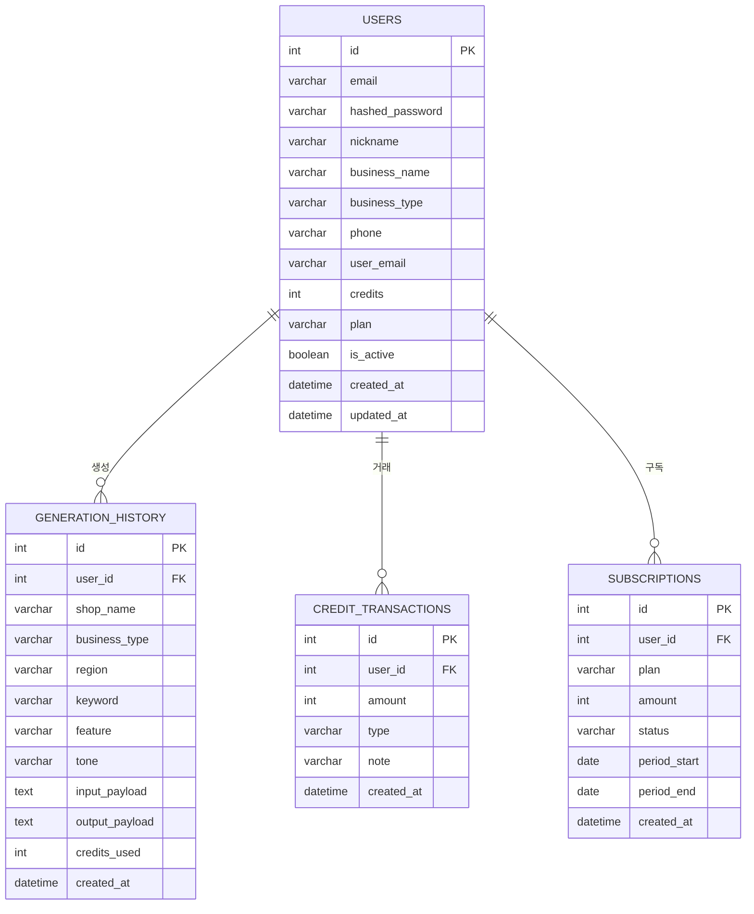

# OwnerBot (사장봇) — 개발과정 기록

> 작성: 유동주 + Claude AI (claude-sonnet-4-6)
> 시작일: 2026-04-06
> 최종 수정: 2026-04-23
> 목표: AI 콘텐츠 자동 생성 플랫폼 — 해커톤 발표 2026-05-14

---

## 프로젝트 개요

| 항목 | 내용 |
|------|------|
| 프로젝트명 | OwnerBot (사장봇) |
| 슬로건 | "사장님의 마케팅, AI가 대신합니다" |
| 목표 | 소상공인이 키워드만 입력하면 블로그·리뷰·쇼츠·썸네일 콘텐츠를 즉시 자동 생성 |
| 타겟 | 동네 소상공인 — 음식점, 카페, 미용실, 학원, 네일샵 등 (직원 5인 이하) |
| 플랫폼 | 모바일 웹 (PWA — 홈 화면 설치 가능) |
| 개발방식 | mockup.html → React SPA → FastAPI 백엔드 → Docker EC2 배포 |
| 해커톤 | 2026-04-06 ~ 2026-05-14 (약 6주) |

---

## 팀 구성

| 이름 | 역할 | 담당 |
|------|------|------|
| 유가영 | 팀장 / PM | 서비스 기획, PRD, 와이어프레임 |
| 이제민 | 팀원 | 백엔드 (FastAPI) |
| 박동제 | 팀원 | 프론트엔드 (PC 웹) |
| 김정원 | 팀원 | 프론트엔드 (PC 웹) |
| **유동주** | **1인 개발** | **mockup · ERD · React 모바일 · EC2 배포** |

---

## 서비스 핵심 가치

### AS-IS (현재 문제)

| 문제 | 설명 |
|------|------|
| 온라인 홍보 시간 부족 | 블로그 글 1편 작성에 평균 1~2시간 소요 |
| SEO 구조 이해 부족 | 네이버 C-rank 로직을 몰라 노출 효과 저조 |
| 마케팅 대행 비용 부담 | 월 30~50만 원 이상 — 소규모 사업자에게 과중한 고정비 |
| 영상 콘텐츠 진입 장벽 | 쇼츠 대본 작성 자체가 어려워 포기 |

### TO-BE (개선 방향)

| 개선 | 설명 |
|------|------|
| 1분 만에 콘텐츠 완성 | 가게 정보 + 키워드 입력만으로 4종 콘텐츠 즉시 생성 |
| SEO 로직 자동 내재화 | 업종·지역·키워드를 조합한 최적화 프롬프트 |
| 저렴한 크레딧 모델 | 가입 시 3크레딧 무료 지급, 이후 건당 결제 |
| 쇼츠 대본 자동화 | AI가 자동 생성, 촬영만 하면 됨 |

---

## 비즈니스 모델

### 크레딧 구조

| 구분 | 내용 |
|------|------|
| 가입 무료 | 3크레딧 자동 지급 |
| 라이트 | 3크레딧 / 3,900원 |
| 베이직 | 10크레딧 / 9,900원 |
| 프로 | 25크레딧 / 19,900원 |

---

## 기술 스택

| 구분 | 기술 | 선택 이유 |
|------|------|----------|
| 프론트엔드 | React 18 + TypeScript (Vite) | 모바일 최적화 SPA, 빠른 빌드 |
| 백엔드 | FastAPI (Python 3.11) | 비동기 지원, Claude AI 스트리밍 친화 |
| DB | PostgreSQL (EC2) | EC2 기존 portfolio-db 컨테이너 공유 |
| AI | Claude API (claude-sonnet-4-6) | 콘텐츠 생성 품질, Anthropic 최신 모델 |
| 인증 | JWT (python-jose) | Stateless, 모바일 호환 |
| CSS | Tailwind CSS | 유틸리티 우선, 빠른 모바일 스타일링 |
| 배포 | Docker + EC2 + Nginx | 기존 portfolio 서버 재활용 |
| PWA | Web App Manifest | 홈 화면 설치, 주소창 없는 앱 경험 |

---

## 프로젝트 디렉토리 구조

```
owner_bot/
├── backend/
│   ├── main.py                  # FastAPI 앱 진입점 + SPA 서빙
│   ├── database.py              # PostgreSQL 연결 (SQLAlchemy)
│   ├── config.py                # 환경변수 설정
│   ├── api/
│   │   └── router.py            # API 라우터 통합
│   ├── modules/
│   │   ├── user/                # 회원가입·로그인·JWT
│   │   │   ├── models.py
│   │   │   ├── schemas.py
│   │   │   ├── router.py
│   │   │   ├── crud.py
│   │   │   └── service.py
│   │   ├── generate/            # AI 콘텐츠 생성
│   │   ├── history/             # 생성 이력·크레딧 거래
│   │   └── mypage/              # 마이페이지·크레딧 충전
│   ├── requirements.txt
│   └── .env                     # SECRET_KEY · ANTHROPIC_API_KEY · DATABASE_URL
├── frontend-react/
│   ├── src/
│   │   ├── App.tsx              # BrowserRouter (basename=/ownerbot)
│   │   ├── lib/api.ts           # apiFetch 공통 함수
│   │   ├── components/
│   │   │   └── NightBackground.tsx  # SVG 밤 배경 (별·달·건물·가로등)
│   │   └── pages/
│   │       ├── LandingPage.tsx
│   │       ├── LoginPage.tsx
│   │       ├── RegisterPage.tsx
│   │       ├── GeneratePage.tsx
│   │       └── MyPage.tsx
│   ├── public/
│   │   ├── manifest.json        # PWA 설정
│   │   ├── ownerbot.jpg         # PWA 아이콘 (스팀펑크 로봇)
│   │   └── main.jpg             # 랜딩 아이콘 이미지
│   ├── .env.production          # VITE_API_BASE=/ownerbot
│   └── vite.config.ts           # base: /ownerbot/ (production)
├── Dockerfile                   # 멀티스테이지: Node 빌드 → Python 서빙
├── docker-compose.yml           # ownerbot 컨테이너 (portfolio-net)
└── requirements.txt
```

---

## ERD (2026-04-22 기준)



<details>
<summary>Users — 회원</summary>

| 필드명 | 타입 | KEY | 설명 |
|--------|------|-----|------|
| id | int | PK | 자동증가 |
| email | varchar | UNIQUE | 로그인 ID (아이디) |
| hashed_password | varchar | | bcrypt 해시 |
| nickname | varchar | | 사장님 이름 |
| business_name | varchar | | 상호명 |
| business_type | varchar | | 업종 |
| phone | varchar | | 전화번호 |
| user_email | varchar | | 이메일 |
| credits | int | | 잔여 크레딧 (기본 3) |
| plan | varchar | | free / monthly |
| is_active | boolean | | 계정 활성화 (기본 True) |
| created_at | datetime | | 가입일시 |

</details>

<details>
<summary>Generation_History — 콘텐츠 생성 이력</summary>

| 필드명 | 타입 | 설명 |
|--------|------|------|
| id | int PK | 자동증가 |
| user_id | int FK | 생성 회원 |
| shop_name | varchar | 가게명 |
| business_type | varchar | 업종 |
| region | varchar | 지역 |
| keyword | varchar | 메인 키워드 |
| feature | varchar | 가게 특징 (선택) |
| tone | varchar | friendly / professional / emotional |
| output_payload | text | 4종 콘텐츠 JSON |
| credits_used | int | 사용 크레딧 (기본 1) |
| created_at | datetime | 생성일시 |

</details>

<details>
<summary>Credit_Transactions — 크레딧 입출금</summary>

| 필드명 | 타입 | 설명 |
|--------|------|------|
| id | int PK | 자동증가 |
| user_id | int FK | 회원 |
| amount | int | 변동량 (양수: 획득, 음수: 차감) |
| type | varchar | earn / use / refund |
| note | varchar | 변동 사유 |
| created_at | datetime | 거래일시 |

</details>

---

## API 명세

### 인증 `/api/auth`

| 메서드 | 경로 | 설명 |
|--------|------|------|
| POST | /signup | 회원가입 (크레딧 3 자동 지급) |
| POST | /login | 로그인 → JWT 토큰 발급 (form-data) |
| GET | /me | 내 정보 조회 (JWT 필요) |

### 콘텐츠 생성 `/api/generate`

| 메서드 | 경로 | 설명 |
|--------|------|------|
| POST | / | 콘텐츠 생성 — 크레딧 1 차감 |

### 이력 `/api/history`

| 메서드 | 경로 | 설명 |
|--------|------|------|
| GET | / | 내 생성 이력 목록 |
| DELETE | /{id} | 이력 삭제 |

### 마이페이지 `/api/mypage`

| 메서드 | 경로 | 설명 |
|--------|------|------|
| GET | /me | 내 정보 조회 |
| GET | /credits | 크레딧 잔액·거래 내역 |
| POST | /charge | 크레딧 충전 |

---

## 배포 구조 (EC2)

```
인터넷
  ↓ HTTPS (443)
Nginx (portfolio-nginx 컨테이너)
  ├── /jewelpro/    → jewelpro:8000
  ├── /mystock/     → mystock-demo:8000
  ├── /malbeot/     → malbeot-app:8000
  └── /ownerbot/    → ownerbot:8000   ← 사장봇
                         ↓
                    FastAPI (uvicorn)
                    ├── /api/*        → 백엔드 API
                    └── /*            → React 빌드 (SPA)
                         ↓
                    portfolio-db (PostgreSQL)
                    └── ownerbot DB
```

### docker-compose.yml 핵심

```yaml
services:
  ownerbot-backend:
    build: .
    container_name: ownerbot
    restart: unless-stopped
    env_file: backend/.env
    expose:
      - "8000"
    networks:
      - portfolio-net

networks:
  portfolio-net:
    external: true
```

### Dockerfile (멀티스테이지)

```
Stage 1: node:20-alpine
  → npm ci
  → npm run build  (React → /dist)

Stage 2: python:3.11-slim
  → pip install requirements.txt
  → COPY backend/
  → COPY --from=Stage1 dist → frontend-react/dist/
  → uvicorn main:app --host 0.0.0.0 --port 8000
```

---

## 개발 일지

### 2026-04-06 — 프로젝트 시작

- 팀 합류 결정, 역할 분담
- 서비스기획서·PRD 검토
- mockup.html 작성 (PC 웹 화면 프로토타입)
- ERD 초안 작성

---

### 2026-04-22 — 풀스택 완성 및 EC2 배포

#### 완료 내용

**백엔드**
- FastAPI + SQLAlchemy + PostgreSQL 구조 완성
- 모듈별 구조 (modules/user, generate, history, mypage)
- JWT 인증 (회원가입·로그인·토큰 검증)
- Claude API 연동 콘텐츠 생성
- 크레딧 시스템 (가입 보너스 3크레딧, 충전, 차감)
- SPA 라우팅 수정 — `/register` 등 직접 접근 404 해결

**프론트엔드 (React)**
- LandingPage — 야경 SVG 배경, 캐릭터 아이콘 이미지, CTA 버튼
- LoginPage — JWT 로그인, 토큰 로컬스토리지 저장
- RegisterPage — 회원가입 (아이디·비밀번호·이름·상호명·업종 등)
- GeneratePage — 입력 폼 + AI 콘텐츠 결과 탭 (블로그·리뷰·쇼츠·썸네일)
- MyPage — 내 정보·크레딧·충전·생성이력·로그아웃

**PWA 설정**
- manifest.json — display: standalone (주소창 없는 앱 경험)
- 홈 화면 설치 시 아이콘: 스팀펑크 로봇 (ownerbot.jpg)
- 설치명: 사장봇

**EC2 배포**
- Dockerfile (멀티스테이지: React 빌드 → Python 서빙)
- docker-compose.yml (portfolio-net 연결)
- nginx.conf ownerbot 블록 추가
- PostgreSQL ownerbot DB 생성
- `.env` 설정 (SECRET_KEY, ANTHROPIC_API_KEY, DATABASE_URL)
- `docker-compose up --build -d` 성공

**디자인 세부 조정** (핸드폰 실시간 확인)
- 야경 SVG 배경 — 별·달·건물·가로등 레이아웃 최적화
- 건물 위치·밝기·투명도 조정
- 가로등 기둥 하늘색으로 숨김
- main.jpg (4종 서비스 아이콘) 랜딩 이미지 적용
- 전체 글자 크기 10% 증가
- 상단 뱃지~헤드라인 간격 50px 조정

---

### 2026-04-23 — UI/UX 개선 및 PWA 완성

#### 완료 내용

**PWA 서비스 워커 추가**
- Chrome에서 다른 앱 사용 중에도 탭 알림이 떠 있던 문제 해결
- `frontend-react/public/sw.js` — fetch-through 최소 서비스 워커 신규 추가
- `main.tsx`에 서비스 워커 등록 코드 추가 (`/ownerbot/sw.js`)
- 서비스 워커 등록 후 Chrome "홈 화면에 추가" → standalone 앱으로 실행 가능

**HTTPS 인증서 확인**
- EC2 Nginx Let's Encrypt 인증서 점검 (E8 ECDSA, 2026-07-12까지 유효)
- 인증서 체인 2개 정상, HTTPS 200 OK 확인

**회원가입·로그인 레이아웃 개선**
- `justify-center` 제거 → 콘텐츠가 많을 때 overflow 되던 문제 해결
- 고정 상단 패딩 적용: RegisterPage `pt-[60px]`, LoginPage `pt-[65px]`
- 회원가입 스크롤 없이 전체 화면에 맞도록 조정
  - 입력 필드 패딩 `py-[5px]` → `py-[4px]` 축소
  - 폼 전체 gap `gap-[10px]` → `gap-[8px]` 축소

**가게 이미지 커버 영역 확장**
- `NightBackground.tsx` 하단 가게 이미지 height `auto` → `220px` 변경
- `objectFit: cover`, `objectPosition: bottom` 적용
- 이미지 하단 고정(`bottom-0`) 유지하면서 빈 공간 자연스럽게 축소

**하단 링크 버튼 황금색 버튼으로 통일**
- 기존: 투명 배경·어두운 텍스트 (상가 이미지 위에서 잘 안 보임)
- 변경: 황금색 배경(`bg-[#b89973]`) + 네이비 텍스트 + 텍스트 너비
- 적용 화면: MyPage 로그아웃, LoginPage 회원가입 이동, RegisterPage 로그인 이동

**"다시 생성 →" 버튼 너비 조정**
- GeneratePage 결과 화면 하단 버튼: `w-full` → `px-6` (텍스트 너비에 맞춤)
- `flex justify-center`로 중앙 배치

---

## 개발 규칙

| 항목 | 내용 |
|------|------|
| 로컬 작업 | Claude가 코드 수정 → git push |
| EC2 작업 | 유동주님이 직접 (`git pull && docker-compose up --build -d`) |
| 스크린샷 | 전체화면 `c:\sc\1.jpg`, 부분캡처 `c:\sc\ss.jpg` |
| 배포 URL | `https://dsic.duckdns.org/ownerbot/` |

---

> 최종 업데이트: 2026-04-23 | 작성: 유동주 + Claude AI (claude-sonnet-4-6)
